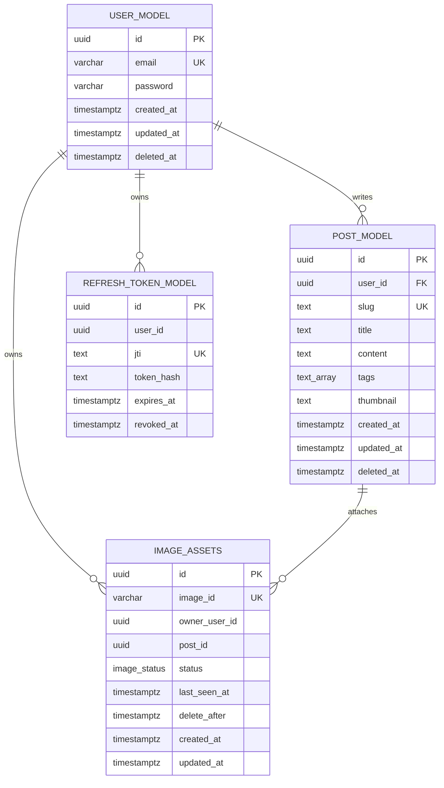

# P-log Server

개인 블로그를 위한 백엔드 API 서버입니다. NestJS와 PostgreSQL을 기반으로 사용자 인증, 게시글 관리, Cloudflare Images 직접 업로드 URL 발급, 이미지 자산 상태 관리, Swagger 문서화를 제공합니다.

## 기술 스택

### Backend

- Node.js
- TypeScript
- NestJS 11
- Express 플랫폼
- NestJS Schedule
- NestJS Swagger

### Database

- PostgreSQL 16
- Drizzle ORM
- Drizzle Kit 마이그레이션

### Authentication

- JWT Access Token
- JWT Refresh Token
- HttpOnly Cookie 기반 인증
- Refresh Token DB 저장 및 해시 보관

### Image

- Cloudflare Images
- Direct Upload URL 발급
- 이미지 자산 상태 추적 및 GC 작업

### Tooling

- pnpm workspace
- ESLint
- Prettier
- Docker Compose

## 실행 방법

```bash
pnpm install
docker compose up -d
pnpm db:migrate
pnpm start:dev
```

로컬 개발 환경에서는 Swagger 문서가 `/api/docs` 경로로 제공됩니다.

## 주요 스크립트

| 명령어             | 설명                      |
| ------------------ | ------------------------- |
| `pnpm start:dev`   | 개발 서버 실행            |
| `pnpm build`       | NestJS 빌드               |
| `pnpm start:prod`  | 빌드 결과 실행            |
| `pnpm lint`        | ESLint 검사 및 자동 수정  |
| `pnpm db:generate` | Drizzle 마이그레이션 생성 |
| `pnpm db:migrate`  | Drizzle 마이그레이션 적용 |
| `pnpm db:studio`   | Drizzle Studio 실행       |

## 환경 변수

| 이름                 | 설명                                       |
| -------------------- | ------------------------------------------ |
| `SERVER_ENV`         | 실행 환경. `development` 또는 `production` |
| `PORT`               | 서버 포트. 기본값 `3001`                   |
| `DATABASE_URL`       | PostgreSQL 연결 문자열                     |
| `JWT_ACCESS_SECRET`  | Access Token 서명 키                       |
| `JWT_REFRESH_SECRET` | Refresh Token 서명 키                      |
| `CF_ACCOUNT_ID`      | Cloudflare 계정 ID                         |
| `CF_IMAGES_TOKEN`    | Cloudflare Images API 토큰                 |
| `CF_ACCOUNT_HASH`    | Cloudflare Images delivery URL 계정 해시   |

## 지원 기능

### 사용자

- 사용자 계정 생성
- 비밀번호 해시 저장
- 인증된 블로그 소유자 계정 조회

### 인증

- 이메일과 비밀번호 기반 로그인
- Access Token과 Refresh Token 발급
- Refresh Token 해시 DB 저장
- Refresh Token 회전 방식의 토큰 재발급
- 로그아웃 시 Refresh Token revoke 처리
- 인증 쿠키 제거

### 게시글

- 게시글 생성
- 게시글 목록 조회
- 게시글 상세 조회
- 게시글 수정
- 게시글 소프트 삭제
- 제목 기반 slug 자동 생성
- slug 충돌 시 suffix 재생성 후 재시도
- 커서 기반 페이지네이션
- 본문에 포함된 Cloudflare 이미지 URL을 기반으로 썸네일 자동 지정
- 본문 이미지와 DB 이미지 자산 상태 동기화

### 이미지

- Cloudflare Images Direct Upload URL 발급
- 업로드 전 이미지 자산을 `temp` 상태로 DB 기록
- 게시글 생성/수정 시 사용된 이미지를 `attached` 상태로 전환
- 게시글에서 제거된 이미지 또는 삭제된 게시글의 이미지를 `delete_pending` 상태로 전환
- Cron 작업으로 만료된 임시 이미지와 삭제 대기 이미지를 Cloudflare에서 삭제

### 문서화와 공통 처리

- Swagger API 문서 제공
- 전역 ValidationPipe 적용
- DTO 기반 요청 값 검증
- 전역 예외 필터로 에러 응답 처리
- CORS credentials 허용

## 정책

### 인증 정책

- 인증 토큰 흐름의 상세 내용은 [docs/auth-token-flow.md](docs/auth-token-flow.md)를 참조합니다.
- 인증은 HttpOnly Cookie 기반 JWT 인증을 기본 정책으로 사용합니다.
- 클라이언트는 토큰 문자열을 직접 저장하지 않습니다.
- 보호 API는 기본적으로 `access_token` 쿠키를 검증합니다.
- `Authorization: Bearer` 헤더도 보조적으로 처리하지만 공식 인증 경로는 쿠키입니다.
- Access Token은 15분 동안 유효합니다.
- Refresh Token은 14일 동안 유효합니다.
- Refresh Token은 원문이 아니라 해시 값으로 DB에 저장합니다.
- 토큰 재발급 시 기존 Refresh Token을 revoke하고 새 Refresh Token을 저장합니다.
- 보호 API 접근 시 JWT payload의 `sub`가 `OWNER_USER_ID`와 일치해야 합니다.

### 쿠키 정책

| 환경        | Secure  | SameSite | HttpOnly |
| ----------- | ------- | -------- | -------- |
| development | `false` | `lax`    | `true`   |
| production  | `true`  | `none`   | `true`   |

| 쿠키            | Path    | Max-Age |
| --------------- | ------- | ------- |
| `access_token`  | `/`     | 15분    |
| `refresh_token` | `/auth` | 14일    |

### 게시글 정책

- 게시글은 `deleted_at`을 사용하는 소프트 삭제 방식으로 삭제합니다.
- 게시글 목록과 상세 조회는 삭제되지 않은 게시글만 반환합니다.
- slug는 제목을 기반으로 생성하며 한글은 유지합니다.
- slug 형식은 `제목기반_slug_랜덤6자리` 형태입니다.
- 삭제되지 않은 게시글의 slug만 유일해야 합니다.
- 게시글 목록은 `created_at DESC`, `id DESC` 기준으로 정렬합니다.
- 페이지네이션은 `createdAt`과 `id`를 base64url로 인코딩한 cursor를 사용합니다.
- 페이지 크기 기본값은 20개이며 최대 100개까지 허용합니다.

### 이미지 정책

- 이미지 업로드는 서버를 경유하지 않고 Cloudflare Direct Upload URL을 통해 처리합니다.
- Direct Upload URL 발급 시 이미지 자산은 `temp` 상태로 저장됩니다.
- 게시글 본문에 남아 있는 Cloudflare 이미지 URL만 실제 사용 이미지로 판단합니다.
- 사용 중인 이미지는 `attached` 상태가 됩니다.
- 게시글 수정으로 제거된 이미지는 `delete_pending` 상태가 되며 6시간 후 삭제 대상이 됩니다.
- 게시글 삭제 시 연결된 이미지는 `delete_pending` 상태가 됩니다.
- `temp` 상태로 24시간이 지난 이미지는 삭제 대상이 됩니다.
- 이미지 GC Cron은 10분마다 실행됩니다.
- GC는 한 번에 최대 100개를 조회하고, 5개 단위로 Cloudflare 삭제 요청을 병렬 처리합니다.
- Cloudflare에서 이미 404로 응답한 이미지는 DB에서 `deleted` 상태로 처리합니다.

## API 요약

| Method   | Path                        | 인증           | 설명                              |
| -------- | --------------------------- | -------------- | --------------------------------- |
| `POST`   | `/user`                     | 없음           | 사용자 계정 생성                  |
| `GET`    | `/user`                     | 필요           | 현재 소유자 계정 조회             |
| `POST`   | `/auth/login`               | 없음           | 로그인 및 인증 쿠키 발급          |
| `POST`   | `/auth/refresh`             | Refresh Cookie | 토큰 재발급                       |
| `POST`   | `/auth/logout`              | Refresh Cookie | 로그아웃 및 쿠키 제거             |
| `POST`   | `/post`                     | 필요           | 게시글 생성                       |
| `GET`    | `/post`                     | 없음           | 게시글 목록 조회                  |
| `GET`    | `/post/:slug`               | 없음           | 게시글 상세 조회                  |
| `PATCH`  | `/post/:slug`               | 필요           | 게시글 수정                       |
| `DELETE` | `/post/:slug`               | 필요           | 게시글 삭제                       |
| `POST`   | `/images/direct-upload-url` | 필요           | Cloudflare Direct Upload URL 발급 |

## DB 스키마

### `user_model`

| 컬럼         | 타입                       | 제약/설명                |
| ------------ | -------------------------- | ------------------------ |
| `id`         | `uuid`                     | PK, 기본 랜덤 생성       |
| `email`      | `varchar(255)`             | unique, not null         |
| `password`   | `varchar(255)`             | not null, 해시 저장      |
| `created_at` | `timestamp with time zone` | not null, 기본 현재 시간 |
| `updated_at` | `timestamp with time zone` | not null, 기본 현재 시간 |
| `deleted_at` | `timestamp with time zone` | nullable                 |

### `refresh_token_model`

| 컬럼         | 타입                       | 제약/설명          |
| ------------ | -------------------------- | ------------------ |
| `id`         | `uuid`                     | PK, 기본 랜덤 생성 |
| `user_id`    | `uuid`                     | not null           |
| `jti`        | `text`                     | unique, not null   |
| `token_hash` | `text`                     | not null           |
| `expires_at` | `timestamp with time zone` | not null           |
| `revoked_at` | `timestamp with time zone` | nullable           |

인덱스:

- `refresh_token_user_id_idx`: `user_id`
- `refresh_token_jti_uq`: `jti` unique

### `post_model`

| 컬럼         | 타입                       | 제약/설명                                      |
| ------------ | -------------------------- | ---------------------------------------------- |
| `id`         | `uuid`                     | PK, 기본 랜덤 생성                             |
| `user_id`    | `uuid`                     | not null, `user_model.id` 참조, cascade delete |
| `slug`       | `text`                     | not null                                       |
| `title`      | `text`                     | not null                                       |
| `content`    | `text`                     | not null                                       |
| `tags`       | `text[]`                   | not null, 기본 빈 배열                         |
| `thumbnail`  | `text`                     | not null                                       |
| `created_at` | `timestamp with time zone` | not null, 기본 현재 시간                       |
| `updated_at` | `timestamp with time zone` | not null, 기본 현재 시간                       |
| `deleted_at` | `timestamp with time zone` | nullable                                       |

인덱스:

- `post_user_id_idx`: `user_id`
- `post_slug_uq`: `slug` partial unique, `deleted_at IS NULL`
- `post_created_at_idx`: `created_at`

### `image_assets`

| 컬럼            | 타입                       | 제약/설명                                   |
| --------------- | -------------------------- | ------------------------------------------- |
| `id`            | `uuid`                     | PK, 기본 랜덤 생성                          |
| `image_id`      | `varchar(128)`             | unique, not null, Cloudflare 이미지 ID      |
| `owner_user_id` | `uuid`                     | not null                                    |
| `post_id`       | `uuid`                     | nullable, 게시글 생성 전 임시 이미지는 null |
| `status`        | `image_status`             | not null, 기본 `temp`                       |
| `last_seen_at`  | `timestamp with time zone` | not null, 기본 현재 시간                    |
| `delete_after`  | `timestamp with time zone` | nullable                                    |
| `created_at`    | `timestamp with time zone` | not null, 기본 현재 시간                    |
| `updated_at`    | `timestamp with time zone` | not null, 기본 현재 시간                    |

`image_status` enum:

- `temp`: 발행 전 임시 이미지
- `attached`: 게시글에 연결된 이미지
- `delete_pending`: 삭제 대기 이미지
- `deleted`: 삭제 완료 이미지

인덱스:

- `idx_image_assets_owner_status`: `owner_user_id`, `status`
- `idx_image_assets_owner_post`: `owner_user_id`, `post_id`
- `idx_image_assets_status_delete_after`: `status`, `delete_after`

## ERD



`post_model.user_id`만 DB 레벨 외래 키로 선언되어 있습니다. `refresh_token_model.user_id`, `image_assets.owner_user_id`, `image_assets.post_id`는 현재 코드에서 논리적으로 연결해 사용하는 관계입니다.
