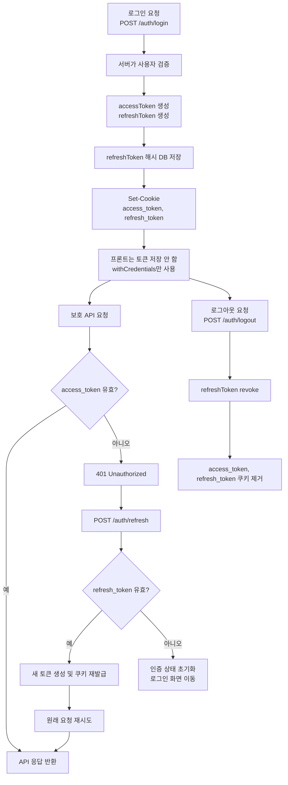
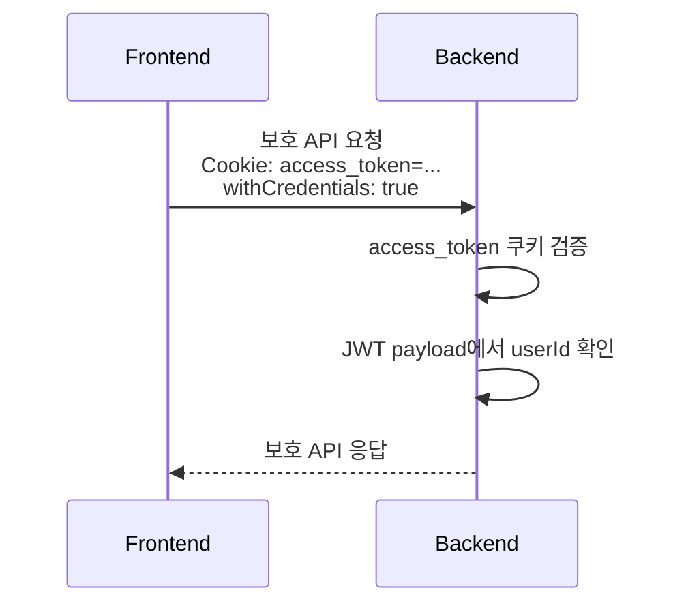
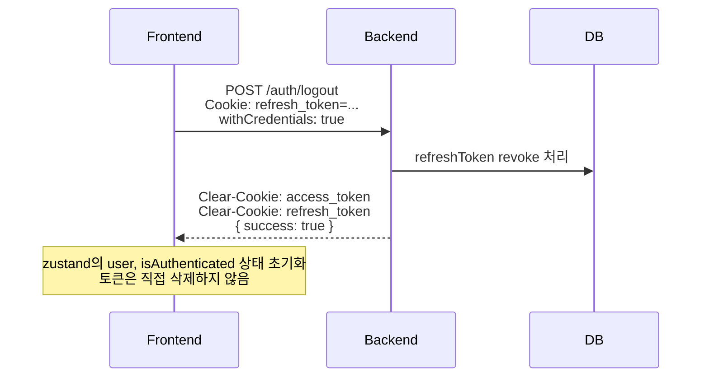

# 인증 토큰 흐름

이 프로젝트의 인증 정책은 **HttpOnly Cookie 기반 JWT 인증**입니다. 프론트엔드는 `accessToken`과 `refreshToken` 값을 직접 저장하지 않고, 브라우저가 관리하는 쿠키를 통해 인증 요청을 보냅니다.

## 핵심 정책

- `access_token`: 보호 API 인증에 사용하는 Access Token입니다.
- `refresh_token`: Access Token 재발급에 사용하는 Refresh Token입니다.
- 두 토큰 모두 서버가 `Set-Cookie`로 내려주며 `HttpOnly` 옵션을 사용합니다.
- 프론트엔드는 토큰을 `localStorage`, `sessionStorage`, zustand persist 등에 저장하지 않습니다.
- 프론트엔드는 axios/fetch 요청에서 쿠키가 포함되도록 설정합니다.
  - axios: `withCredentials: true`
  - fetch: `credentials: 'include'`
- 보호 API는 `access_token` 쿠키를 검증합니다.
- Access Token 만료로 401이 발생하면 `/auth/refresh`를 호출한 뒤 실패했던 요청을 재시도합니다.

## 전체 인증 흐름



## 쿠키 설정

현재 서버는 환경에 따라 기본 쿠키 옵션을 다르게 사용합니다.

```txt
local development
HttpOnly; Secure=false; SameSite=Lax

production
HttpOnly; Secure=true; SameSite=None
```

쿠키별 경로와 만료 시간은 다음과 같습니다.

```txt
access_token
- Path=/
- Max-Age=15분

refresh_token
- Path=/auth
- Max-Age=14일
```

## 로그인 흐름

```mermaid
sequenceDiagram
  participant FE as Frontend
  participant BE as Backend
  participant DB as DB

  FE->>BE: POST /auth/login<br/>email, password<br/>withCredentials: true
  BE->>DB: 사용자 계정 검증
  DB-->>BE: 사용자 정보
  BE->>BE: accessToken 생성<br/>refreshToken 생성
  BE->>DB: refreshToken 해시 저장
  BE-->>FE: Set-Cookie: access_token=...; HttpOnly<br/>Set-Cookie: refresh_token=...; HttpOnly<br/>{ success: true }

  Note over FE: 토큰 값은 JS 상태에 저장하지 않음<br/>브라우저가 HttpOnly 쿠키로 관리
```

로그인 성공 후 응답 body에는 토큰 문자열이 포함되지 않습니다.

```json
{
  "success": true
}
```

## 보호 API 요청 흐름



프론트엔드는 `Authorization: Bearer <accessToken>` 헤더를 만들 필요가 없습니다. 공식 인증 경로는 `access_token` 쿠키입니다.

## 토큰 재발급 흐름

```mermaid
sequenceDiagram
  participant FE as Frontend
  participant BE as Backend
  participant DB as DB

  FE->>BE: 보호 API 요청<br/>Cookie: access_token=만료됨
  BE-->>FE: 401 Unauthorized

  FE->>BE: POST /auth/refresh<br/>Cookie: refresh_token=...<br/>withCredentials: true
  BE->>BE: refresh_token 검증
  BE->>DB: refreshToken 상태 확인 및 교체
  DB-->>BE: 갱신 성공
  BE->>BE: 새 accessToken 생성<br/>새 refreshToken 생성
  BE-->>FE: Set-Cookie: access_token=새 토큰; HttpOnly<br/>Set-Cookie: refresh_token=새 토큰; HttpOnly<br/>{ success: true }

  FE->>BE: 실패했던 원래 요청 재시도<br/>Cookie: access_token=새 토큰
  BE-->>FE: 보호 API 응답
```

재발급 성공 응답도 토큰 문자열을 노출하지 않습니다.

```json
{
  "success": true
}
```

## 로그아웃 흐름



로그아웃 시 서버는 인증 쿠키를 제거합니다. 프론트엔드는 사용자 상태만 초기화하면 됩니다.

## 프론트엔드 구현 기준

프론트엔드 상태 관리에는 토큰을 저장하지 않습니다.

```txt
저장하지 않음
- accessToken
- refreshToken

저장 가능
- user
- isAuthenticated
- isLoading
```

axios 인스턴스에는 다음 설정이 필요합니다.

```ts
const axiosInstance = axios.create({
  baseURL: API_BASE_URL,
  withCredentials: true,
});
```

요청 인터셉터에서 Authorization 헤더를 붙이는 로직은 제거합니다.

```ts
// 사용하지 않음
config.headers.Authorization = `Bearer ${accessToken}`;
```

401 응답 처리 흐름은 다음 기준으로 구현합니다.

```txt
1. 보호 API 요청에서 401 발생
2. /auth/refresh 호출
3. refresh 성공 시 원래 요청 재시도
4. refresh 실패 시 인증 상태 초기화 후 로그인 화면으로 이동
```

## 백엔드 구현 위치

- 로그인/재발급/로그아웃 쿠키 처리: `src/auth/auth.controller.ts`
- Access Token 검증 가드: `src/shared/auth/token.guard.ts`
- 쿠키 이름 및 Cookie 헤더 파싱 유틸: `src/shared/auth/utils.ts`
- Swagger Cookie Auth 설정: `src/shared/swagger/setup.ts`
